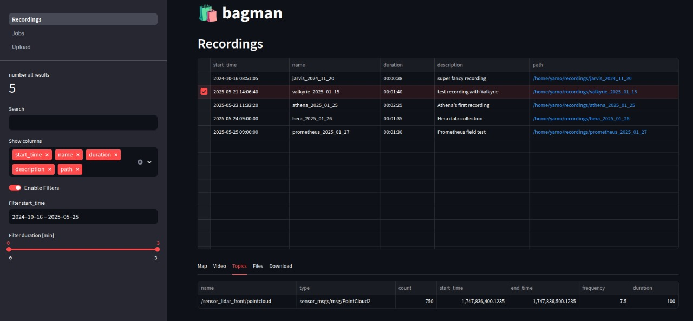

# Bagman

**Bagman** is a ROS 2 **bag** (.mcap) **man**agement tool.



## Features

- **CLI**
- **Database:** [TinyDB](https://github.com/msiemens/tinydb)
- **Dashboard:** [Streamlit](https://github.com/streamlit/streamlit)
- **Pipeline (TODO):** [Perfect](https://github.com/PrefectHQ/prefect)

## Prerequisites

- Docker
- Docker Compose
- yq

## Installation

1. Clone the repository:
    ```sh
    git clone /home/yamo/code/bagman
    cd bagman
    ```

2. Build the Docker image:
    ```sh
    docker build -t bagman .
    ```

3. Set the recording path:
    ```sh
    echo "RECORDING_PATH=$(yq '.recording_path' config.yaml)" > .env
    echo "DASHBOARD_PORT=$(yq '.dashboard_port' config.yaml)" >> .env
    ```

4. Start the application:
    ```sh
    docker-compose up -d
    ```

## Contributing

Use pre-commit:

1. Install pre-commit:
    ```sh
    pip install pre-commit
    ```

2. Run pre-commit:
    ```sh
    pre-commit
    ```
