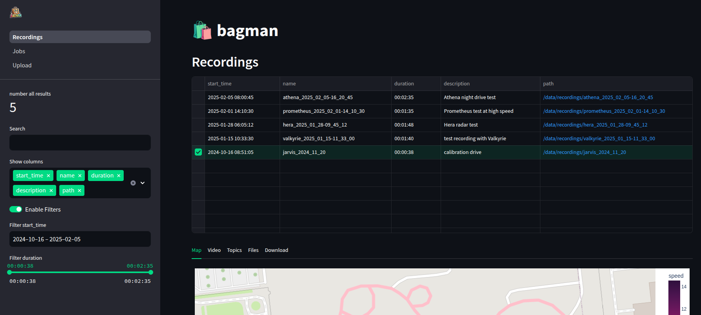

<p align="left">
    
</p>

# Bagman

**Bagman** is a ROS 2 **bag** (.mcap) **man**agement tool.

<p align="center">
    
</p>

<details>
    <summary>Table of Contents</summary>

- [Features](#features)
- [Getting started](#getting-started)
  - [Prerequisites](#prerequisites)
  - [Run Dashboard](#run-dashboard)
  - [Run CLI](#run-cli)
  - [Database Integration](#database-integration)
- [Contributing](#contributing)

</details>


## Features

- **CLI Tool:** includes administrative commands for managing recordings
- **NoSQL Database Support:** compatible with [MongoDB](https://github.com/mongodb/mongo), [Elasticsearch](https://github.com/elastic/elasticsearch), and [TinyDB](https://github.com/msiemens/tinydb)
- **[Streamlit](https://github.com/streamlit/streamlit) Dashboard:** interactively search for recordings and explore their content
- **[Prefect](https://github.com/PrefectHQ/prefect) Pipeline (in development):** define and execute workflows by selecting tasks and applying them to recordings


## Getting started

### Prerequisites

- Docker (`apt install docker.io`)
- Docker Compose (`apt install docker-compose`)
- yq (`snap install yq`)

Clone the repository:
```sh
git clone https://github.com/yannikmotzet/bagman.git && cd bagman
```

### Run Dashboard

1. Build the Docker image:
    ```sh
    docker build -t bagman .
    ```

2. Set environment variables for docker-compose:
    ```sh
    echo "RECORDINGS_STORAGE=$(yq '.recordings_storage' config.yaml)" > .env
    echo "DASHBOARD_PORT=$(yq '.dashboard_port' config.yaml)" >> .env
    ```

3. Start the application:
    ```sh
    docker-compose up -d
    ```

4. Open Dashboard in browser: [localhost:8502](http://localhost:8502/)

### Run CLI

1. Install the package:
    ```sh
     pip install .
     ```
     > **Note:** For development use `pip install -e .` which creates a symbolic link to the source code.

2. Execute the CLI:
    ```sh
    bagman
    ```

    ```plaintext
    bagman CLI

    positional arguments:
      {upload,add,update,delete,remove,exist,connection,metadata}
        upload              upload local recording to storage (optional: add to database)
        add                 add a recording to database or update existing one
        update              update an existing recording in database
        delete              delete a recording from storage (optional: remove from database)
        remove              remove a recording from database
        exist               check if recording exists in storage and database
        connection          check connection to the storage and database
        metadata            (re)generate metadata file for a local recording

    options:
      -h, --help            show this help message and exit
      -c CONFIG, --config CONFIG
                            path to config file, default: config.yaml in current directory
    ```

### Database Integration

Currently, the following databases are supported:
- **MongoDB**
- **Elasticsearch**
- **TinyDB** (based on .json file)

Database integration is managed through the `config.yaml` file and environment variables. The `database_uri` field specifies the connection details for the selected database, while authentication credentials can be provided via a `.env` file.

#### TinyDB
For TinyDB, set the `database_uri` field in `config.yaml` to the path of the `.json` file:
```yaml
database_uri: path/to/database.json
```

#### Elasticsearch
For Elasticsearch, set the `database_uri` field in `config.yaml` to the URL of the database:
```yaml
database_uri: http://localhost:9200
```

Additionally, specify the `database_name` field in `config.yaml` to define the Elasticsearch index name:
```yaml
database_name: your_index_name
```

If authentication is required, add the credentials to a `.env` file:

For username/password authentication:
```env
DATABASE_USER=your_username
DATABASE_PASSWORD=your_password
```

For API key authentication, use a Base64-encoded key:

```env
DATABASE_TOKEN=your_base64_encoded_api_key
```
> **Note:** Use either username/password or API key, but not both.

#### MongoDB
For MongoDB, set the `database_uri` field in `config.yaml` to the connection URL:
```yaml
database_uri: mongodb://localhost:27017
```

Additionally, specify the `database_name` field in `config.yaml` to define both the MongoDB database name and the collection name:
```yaml
database_name: your_collection_name
```

If authentication is required, add the credentials to a `.env` file:
```env
DATABASE_USER=your_username
DATABASE_PASSWORD=your_password
```

### Notes
- Ensure the `.env` file is located in the same directory as your application.
- The application will automatically load the environment variables from the `.env` file during runtime.
- Using username and password inside the database URL is not recommended for security reasons.
- For more details, refer to the documentation of the respective database.


## Contributing

Use pre-commit:

1. Install pre-commit:
    ```sh
    pip install pre-commit
    ```

2. Run pre-commit:
    ```sh
    pre-commit
    ```
